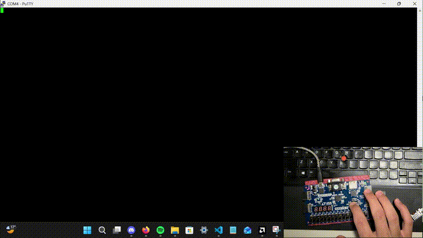

# PIPELINED RISCV PROCESSOR

## Description

- Full 5-stage pipelined (Fetch1, Fetch2, Decode, Execute, Memory1, Memory2, Writeback) RISCV CPU
written in SystemVerilog.

- Supports the full RV32I ISA.

- Verified with continous integration (CI) of various test benches (tb) including:
    - Individual tbs for all major componenets.
    - Top-level tb testing all major instruction types using Assembly code. 
    - Running a Sieve of Eratosthenes algorithim program to find all prime numbers <100.

- Fully synthesized on physical FPGA (Basys 3 AMD Artix™ 7) with AMD's Vivado design suite.
    - F<sub>max</sub> = 100 MHz

- Functioning memory-mapped UART Tx peripheral.

- Demo Gif:



Gif of CPU synthesized onto a FPGA (Basys3) calculating the first 50 terms of the Fibanocci sequence and transmitting them via UART (see `Peripherals/Programs/fibonacci_uart.s`).

## Project Structure

```
5-stage-pipelined-riscv-processor/
├── RTL/                          # SystemVerilog hardware source files
│   ├── riscv_pkg.sv              # Shared types, structs, and helper functions
│   ├── Top/
│   │   └── top_level.sv          # Top-level 5-stage pipelined CPU
│   ├── Data Path/                # ALU, register file, PC, memories, imm gen
│   │   ├── alu.sv
│   │   ├── reg_file.sv
│   │   ├── pc.sv
│   │   ├── imm_gen.sv
│   │   ├── instr_mem.sv
│   │   └── data_mem.sv
│   ├── Control Unit/              # Instruction decoding
│   │   ├── main_decoder.sv
│   │   ├── alu_decoder.sv
│   │   ├── mem_decoder.sv
│   │   ├── branch_decoder.sv
│   │   └── pc_comparator.sv
│   ├── Pipeline/                  # Pipeline registers (F1F2, FD, DE, EM, M1M2, MW)
│   │   ├── f1f2_reg.sv
│   │   ├── fd_reg.sv
│   │   ├── de_reg.sv
│   │   ├── em_reg.sv
│   │   ├── m1m2_reg.sv
│   │   └── mw_reg.sv
│   ├── Hazards/                   # Forwarding and stall/flush logic
│   │   ├── fwd_unit.sv
│   │   └── hzrd_unit.sv
│   ├── Primatives/                # Generic reusable building blocks
│   │   ├── adder.sv
│   │   ├── 2to1_mux.sv
│   │   └── 4to1_mux.sv
|   ├── Demo/                      # First 50 terms of the Fibonacci sequence being calculated and 
|   |   └── fibonacci_demo.gif     # transmitted over a memory-mapped UART
│   └── schematic.png              # Full schematic of RTL design
│
├── Peripherals/                   # Memory-mapped peripherals
│   ├── uart_tx.sv
│   └── Programs/                  # Assembly demo programs (UART output)
│       ├── uart_test.s / .hex
│       ├── prime_sieve_uart.s / .hex
│       ├── fibonacci_uart.s / .hex
│       ├── bin_to_hex.py
│       └── Makefile
│
├── FPGA/                          # FPGA top level + constraints (Basys3)
│   ├── fpga_top.sv
│   ├── Basys-3-Master.xdc
│   └── synth_fanout.xdc
│
├── Verification/                  # Testbenches and architectural compliance
│   ├── Unit Test Benches/         # Per-module testbenches
│   │   ├── alu_tb.sv
│   │   ├── reg_file_tb.sv
│   │   ├── imm_gen_tb.sv
│   │   ├── data_mem_tb.sv
│   │   ├── instr_mem_tb.sv
│   │   └── hzrd_and_fwd_tb.sv
│   ├── Top Level Tests/           # Full-CPU integration tests
│   │   ├── top_level_tb.sv
│   │   └── Assembly Programs/     # Arithmetic, branch, jump, load/store, etc.
│   └── ArchTests/                 # RISC-V riscv-arch-test (ACT4) compliance suite (WIP)
│       ├── riscv-cpu-rv32i.yaml
│       ├── test_config.yaml
│       ├── link.ld
│       ├── act4_test_tb.sv
│       └── run_act4_tests.sh
│
├── .github/workflows/
│   └── test.yml                   # CI: runs run_tests.sh on push/PR
├── run_tests.sh                   # Runs all unit + top-level testbenches (Icarus)
└── README.md
```

## Prerequisites & Local Setup

### Required

- **Icarus Verilog** (`iverilog` / `vvp`) — used to compile and run all testbenches via `run_tests.sh`.
```bash
  # Ubuntu/Debian
  sudo apt-get update
  sudo apt-get install -y iverilog
```

- **Python 3** — used by `bin_to_hex.py` to convert assembled binaries into `.hex` files.
```bash
  sudo apt-get install -y python3
```

- **RISC-V GNU toolchain** (`riscv-none-elf-as`, `-ld`, `-objcopy`) — used by the `Makefile`s under
  `Peripherals/Programs/` and `Verification/Top Level Tests/Assembly Programs/` to assemble the `.s`
  programs into `.hex` files. Any RV32I-capable `riscv*-elf` toolchain works; just point `PREFIX` in
  the Makefile at your installed prefix if it differs from `riscv-none-elf-`.

### Running the test suite

```bash
chmod +x ./run_tests.sh
./run_tests.sh
```

This compiles every unit testbench (ALU, register file, immediate generator, data/instruction
memory, hazard/forwarding unit) plus the full `top_level_tb.sv`, and exits non-zero if any assertion
fails — the same script CI runs on every push/PR (see `.github/workflows/test.yml`).

### Optional: FPGA synthesis (Basys 3)

- **Xilinx Vivado** (any recent version supporting the Artix-7 XC7A35T) — needed to synthesize
  `FPGA/fpga_top.sv` using the provided `FPGA/Basys-3-Master.xdc` constraints file and
  `FPGA/synth_fanout.xdc` for fanout control.

### Optional: RISC-V Architectural Compliance Tests (ACT4) (Not yet implimented) 

Only needed if you want to run the (currently CI-disabled) architectural test suite under
`Verification/ArchTests/`:

- [`riscv-arch-test`](https://github.com/riscv/riscv-arch-test) (`act4` branch)
- [`sail-riscv`](https://github.com/riscv/sail-riscv) reference model (`sail_riscv_sim`)
- A RISC-V GCC toolchain (`riscv32-unknown-elf-gcc`, `-objcopy`, `-nm`)
- [`mise`](https://mise.jdx.dev/) plus the ACT4 framework's Python deps (`pip install -e ./framework -e ./generators/testgen -e ./generators/coverage`)

Then run:
```bash
chmod +x "Verification/ArchTests/run_act4_tests.sh"
"Verification/ArchTests/run_act4_tests.sh" /path/to/riscv-arch-test
```

## Future Improvements & Extensions

- Official RISCV ACT4 test support and verification
- M-extension (multiply and divide)
- Full CRS and Trap handling
- UART Rx peripheral
- FIFO buffer for peripherals
